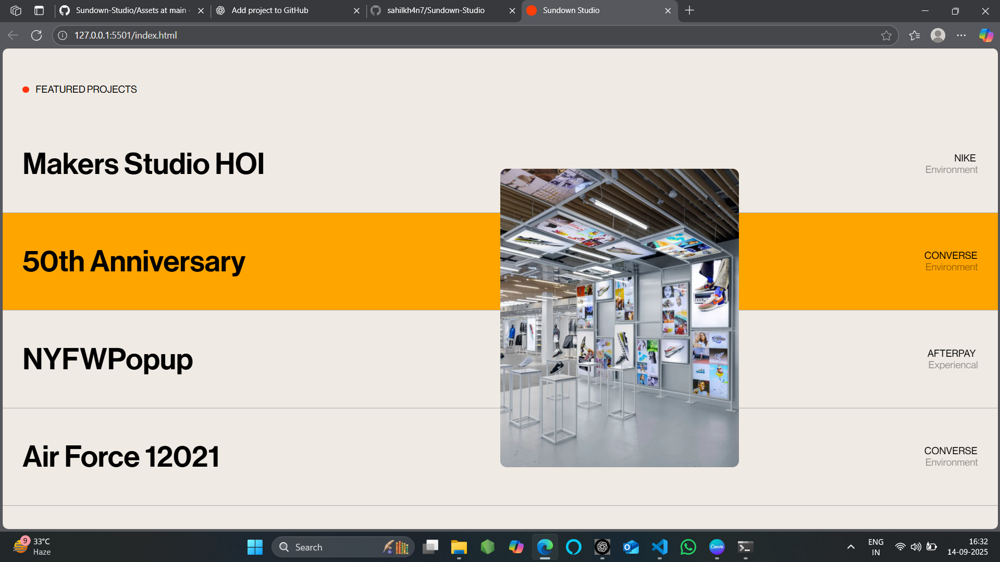

# Sundown Studio Clone 🎨

A responsive front-end project inspired by **Sundown Studio**.  
This website demonstrates smooth animations, scrolling effects, and a modern design layout built with **HTML, CSS, and JavaScript**.

---

## 🚀 Features
- Smooth scrolling powered by [Locomotive Scroll](https://locomotivemtl.github.io/locomotive-scroll/).
- Animation effects using [GSAP](https://greensock.com/gsap/).
- Responsive navigation (hamburger menu for mobile).
- Interactive **featured projects** section with hover image preview.
- Modern design with custom typography (Neue Haas Display).
- Video and image background elements.

---

## 🛠️ Technologies Used
- **HTML5**
- **CSS3** (Flexbox, Animations, Media Queries)
- **JavaScript (ES6+)**
- [Locomotive Scroll](https://locomotivemtl.github.io/locomotive-scroll/)
- [GSAP + ScrollTrigger](https://greensock.com/scrolltrigger/)

---

## 📸 Preview


---

## 🔧 Installation & Usage
1. Clone this repository:
   ```bash
   git clone https://github.com/sahilkh4n7/Sundown-Studio.git
Open the project folder in VS Code (or any editor).

Open index.html in a browser to view the site.
(For best results, use Live Server in VS Code.)

📱 Responsiveness

Desktop: Full navigation + animations.

Mobile: Hamburger menu + adjusted layouts.

✨ Future Improvements

Add backend (if needed) for contact form.

Improve accessibility (ARIA labels, alt text).

Optimize images for faster load times.

📄 License

This project is for educational purposes only.
Feel free to fork and experiment 🚀.

---
